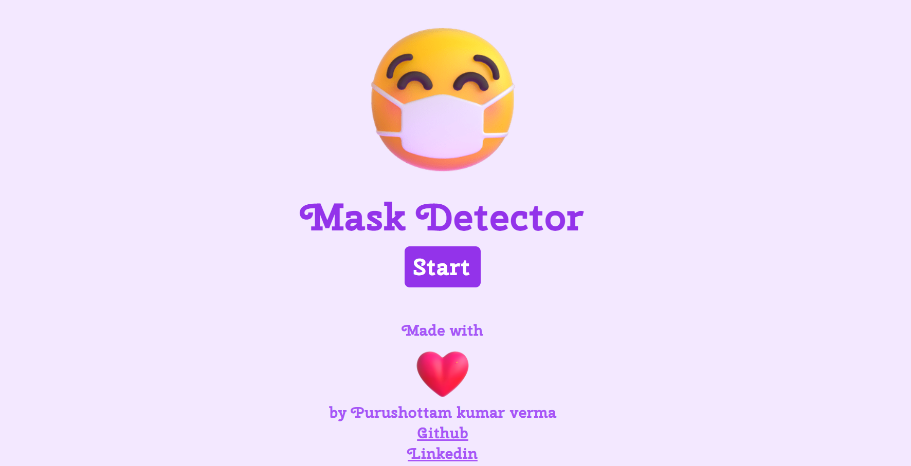

# maskDetector (https://purushottam30.github.io/Mask-Detector/)

### FRT SUBMISSION
This is a project created for Future Ready Talent Internship

### Project Description Industry: 

Health

### Project Title: 

Mask Detector using computer vision

### Problem Statement/Opportunity: 

To track if the people are wearing a mask or not.

### Project Description: 

As the health risks rise day by day due to various viruses we need ways to protect ourselves and our family via technology that can be used in an efficient and effective manner. The technology that can have advantage is computer vision with which the users can be identified if they are wearing a mask or not.

### Primary Azure Technology:
Visual Studio Code, Static Web Apps.

## [Demo](https://purushottam30.github.io/Mask-Detector/) 

